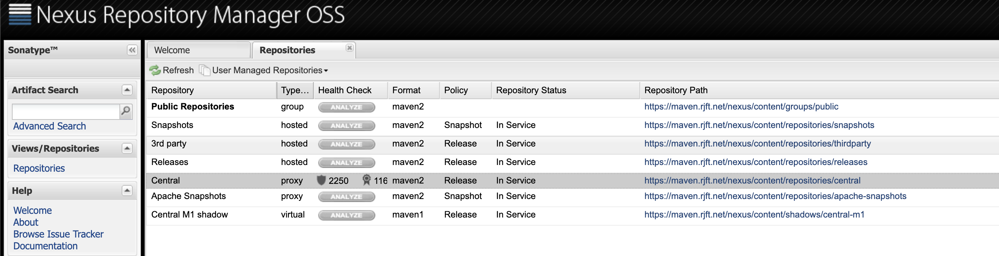

# MAVEN 

## 命令
 * mvn clean  install -U  ：  `-U`参数强制让Maven更新

## 依赖范围 
   * compile ：编译依赖范围，如果没有指定则默认此范围-对编译、测试、运行都有效
   * test ：测试依赖范围，此依赖范围只对此时classPath 有效，在编译和运行时无法使用
   * provided ： 已提供依赖范围，此依赖范围对于编译和测试有效，但是对于运行无效
   * runtime ：运行时依赖范围， 对于测试和运行时有效，但是对于编译主代码时无效
   * system ： 系统依赖范围，该依赖范围和 `provided`  完全一样。
      但是使用的时候必须通过systemPath元素显示的指定依赖文件路径，
      该依赖不通过maven仓库解析，而且往往与本机系统绑定，可能造成不可移植，谨慎使用
   * import(maven 2.9 +) : 导入依赖范围，该依赖范围不会对三种classPath产生任何影响  
   
 
> 最左边一列表示第一直接依赖范围   最上边一行表示第二直接依赖范围   

|          | compile | test   | provided| runtime |  
|  :---    | :---:   | :---:  |  :---:  |   :---: | 
| compile  | compile | ---    |  ---    |  runtime|  
| test     | test    | ---    |  ---    |  test   |   
| provided | provided| ---    |provided | provided|
| runtime  | runtime | ---    |  ---    | runtime |  

-------------------


## 依赖解调(Dependency Mediation)  

- 第一原则 ：路径最短者优先   
- 第二原则 ：第一声明者优先
  *   在依赖长度相等的前提下，在POM中定义的声明的顺序决定了谁会被解析使用，顺序靠前的那个依赖被使用  

## 优化依赖  
- 查看当前项目的已解析的依赖（直接依赖、传递性依赖） `mvn dependency:list`  
- 查看当前项目的已解析依赖的依赖树 `mvn dependency:tree`  
- 分析当前项目依赖 `mvn dependency:analyze`  
   查看分析结果可分为两大部分：  
    * `Used undeclared dependencied` ：指项目中使用到的但是没有显示声明的依赖，此种依赖没有显示声明，容易忽略，不易发现
    * `Unused declared dependencies` ：指项目中未使用的，但是显示声明的依赖。对于这种依赖也不能简单地删除，
      由于 `dependency:analyze` 只会分析编译主代码合测试代码需要用到的依赖，一些执行测试和运行时的依赖它发现不了   


---
 


## 生命周期和插件    
> Maven 的生命周期是抽象的，实际上都是由插件来完成。生命周期和插件两者协同工作，密不可分。
>例如针对编译的插件有 `maven-compiler-plugin`、针对测试的插件有`maven-surefire-plugin`   

### 生命周期   
Maven拥有三套相互独立的生命周期分别为 : 
- clean :清理项目  
    clean生命周期包含三个阶段  
    * pre-clean 执行一些清理前需要完成的工作
    * clean 清理上一次构建生成的文件
    * post-clean 执行一些清理后需要完成的工作
- default ：构建项目  
  default生命周期定义了真正构建时需要执行的所有步骤
    * validate
    * initialize
    * generate-sources
    * process-sources：处理项目主资源文件，一般来说，是对 src/main/resources 目录的内容进行变量替换工作后，复制到项目输出的主classpath目录中
    * compile ： 编译项目主代码一般来说，是编译 src/main/java 目录下的java文件到项目输出的主classpath目录中  
    * process-classes
    * generate-test-sources
    * process-test-sources ：处理项目测试资源文件
    * generate-test-resource
    * process-test-resources
    * test-compile : 编译项目测试代码
    * process-test-classes
    * test ：使用单元测试框架进行测试，但是测试代码不会进行打包活部署
    * prepare-package
    * package ：接受编译好的代码，打包成可发布的格式，如JAR
    * pre-integration-test
    * integration-test
    * post-integration-test
    * verify
    * install ：将打包好的文件安装到Maven本地仓库，供本地其他项目使用
    * deploy ： 将最终的包复制到远程仓库，供其他Maven项目使用  
- site ：建立服务站点
    site的生命周期是建立和发布项目站点，Maven能够基于POM所包含的信息，自动生成一个友好的站点，方便团队交流和发布项目信息
    * pre-site ： 执行一些在项目站点之前需要完成的工作
    * site ：生成项目站点文件
    * post-site ：执行以下在生成项目站点之后需要完成的工作
    * site-deploy ：将生成的项目站点发布到服务器上    

---

## 聚合与继承  
### 聚合  
 `<module>` 声明模块 
 
### 继承
`<parent>` 声明父模块   
      
有哪些POM元素是可以被继承的:
   * groupId :项目id，项目坐标的核心元素  
   * version :项目版本，项目坐标的核心元素   
   * description :项目中的描述信息 
   * organization :项目的组织信息
   * inception Year :项目的创始年份
   * url:项目中的url
   * developer :项目中的开发者信息
   * contribution :项目中的贡献者信息
   * distributionManagement ：项目的部署配置
   * issueManagement ：项目的缺陷跟踪系统信息
   * ciManagement ：项目的持续集成信息
   * scm ：项目的版本控制系统信息
   * mailingLists ：项目的邮件信息
   * properties ：自定义的Maven属性
   * dependencyManagement ：项目的依赖配置管理
   * repositories ：项目的仓库信息
   * build ： 包括项目的源码目录配置、输出目录配置、插件配置、插件管理配置
   * reporting ： 包括想的报告输出目录配置、报告插件配置等。  
 
#### 依赖管理
 `distributionManagement` 该元素既能让子模块集成到父模块的依赖配置，又能保证子模块依赖的灵活使用，在`distributionManagement`元素  
 下的依赖声明不会引入实际的依赖，不过它能约束 `dependency`下的依赖使用。  
 插件同理 --> `pluginManagement`   
 

----

## 私服  

* 私服优点
  - 节省自己的外网带宽
  - 加速Maven构件
  - 部署第三方构件
  - 提高稳定性，增强控制
  - 降低中央仓库的负荷  

## 远程仓库  
#### 配置  

```xml
<package> 
 ...
  <!-- repositories 元素下可声明多个元素 -->
   <repositories>
    <repository>
        <id>jboos</id>
        <name>JBoos Repository</name>
        <url>http://repository.jboos.com/maven2</url>
        <releases>
            <enabled>true</enabled>
        </releases>
        <snapshots>
            <!--  关闭SNAPSHOT 版本的下载      -->
            <enabled>false</enabled>
             <!-- updatePolicy 配置maven从远程仓库检查更新的频率 默认为： daily 表示每天检查一次
              可用值：
                daily：每天检查一次 （默认）
                never：从不检查
                always：每次构建都检查一次
                interval-X ： 每隔X分钟检查一个更新
              用户可添加参数  `-U` 来强制更新
             -->
            <updatePolicy>daily</updatePolicy>
            <!-- checksumPolicy 检查校验和文件的策略。 当构件被部署到Maven仓库时会同时不失对应的校验和文件，在下载时Maven会验证校验和文件
                 可选值：
                    warn ：执行构建时输出告警信息 （默认）
                    fail ：Maven遇到校验和错误就使构建失败
                    ignore：使Maven完全忽略检验和错误
             -->
            <checksumPolicy>ignore</checksumPolicy>
        </snapshots>
    </repository>
   </repositories>
</package>
```

```text
上述配合远程仓库的方式只能对当前Maven 项目有效。但是我们往往想通过一次配置就让本机所有Maven项目都是用自己的私服，
但是呢 `setting.xml` 不支持直接配置 `repositories`和 `pluginRepositories`。所幸Maven还提供了`Profile`机制  
能让用户将仓库配置放到`setting.xml`中

```
```xml
<settings>
     <profiles>
        <profile>
          <id>aliyun</id>
          <repositories>
            <repository>
              <id>nexus-aliyun</id>
              <url>http://maven.aliyun.com/nexus/content/groups/public</url>
              <releases>
                <enabled>true</enabled>
              </releases>
              <snapshots>
                <enabled>false</enabled>
              </snapshots>
            </repository>
          </repositories>
        </profile>
    </profiles>
     
  <!-- activeProfiles | List of profiles that are active for all builds. | -->
  <!-- 当执行构建的时候，Nexus 会将这个 activeProfiles 激活，激活的 profile 会将仓库信息应用到项目中去-->
  <activeProfiles>
     <activeProfile>aliyun</activeProfile>
  </activeProfiles>
</settings>
```


#### 认证 
> 配置认证信息与配置仓库信息不同，仓库信息可直接配置在POM文件中，但认证信息必须在 `setting.xml` 中，
> 用 `servers`表示。 `server`元素的id必须与POM中序号认证的`repository`的 id 完全一致
```xml
  <servers>
    <!-- server | Specifies the authentication information to use when connecting 
    to a particular server, identified by | a unique name within the system (referred 
    to by the 'id' attribute below). | | NOTE: You should either specify username/password 
    OR privateKey/passphrase, since these pairings are | used together. | <server> 
      <id>deploymentRepo</id> <username>repouser</username> <password>repopwd</password> 
    </server> -->

    <!-- Another sample, using keys to authenticate. <server> <id>siteServer</id> 
      <privateKey>/path/to/private/key</privateKey> <passphrase>optional; leave 
        empty if not used.</passphrase> </server> -->
    <server>
      <id>releases</id>
      <username>admin</username>
      <password>admin123</password>
    </server>
    <server>
      <id>snapshots</id>
      <username>admin</username>
      <password>admin123</password>
    </server>

    <!--<server>
      <id>snapshots</id>
      <username>deployment</username>
      <password>I3tdMEzuE00HXbvCcb4FQIF</password>
    </server>
    <server>
      <id>releases</id>
      <username>deployment</username>
      <password>I3tdMEzuE00HXbvCcb4FQIF</password>
    </server>-->
  </servers>
```

## 使用Nexus创建私服


 
 #### Nexus四种类型
- group ：仓库组
- hosted ：宿主
- proxy ：代理
- virtual ：虚拟
#### Nexus 访问控制模型
Nexus 是基于权限（Privilege）做访问控制的，服务器的每个资源都有相应的权限来控制。  
Nexus 预定义了三个用户对应了三个权限级别  
- admin ：该用户拥有对Nexus服务的完全控制，默认密码是 admin123
- deployment ： 该用户能够访问Nexus，浏览仓库内容，搜索，并且上传部署构件，但是无法对Nexus进行任何配置，默认密码为`deployment123`
- anonymous ： 该用户对应了所有未登录的匿名用户，他们可以浏览仓库库并进行搜索  
Nexus 预定义了一下常用且重要的角色  
- UI：`Basic UI Privileges` ：包含可访问Nexus界面必须的最基本权限
- UI：`Repository Browser` ：包含了浏览仓库页面所需要的权限
- UI：`Search` ： 包含了访问快速搜索栏及搜索页面所需要的权限
- Repo：`All Repositories （Read）` ：给予用户读取所有仓库内容的权限，没有仓库的读取权限，用户将无法在仓库页面上看到实际的仓库内容，
  也无法从 `Nexus` 上下载构件
- Repo：`All Repositories（Full control）`： 给予用户完全控制所有仓库内容的权限。用户不仅可浏览、下载构件，还可以部署构件及删除仓库内容   

---
## 使用Maven进行测试  
#### 跳过测试  
> Maven 跳过测试 `skipTests`(不会跳过测试编译、只跳过运行) OR `maven.test.skip=true`（跳过测试编译、测试运行）  

#### 动态指定要运行的测试用例
> `mvn test -Dtest = Random*test`  OR  `mvn test -Dtest = Randomtest,HelloTest`  

#### 测试覆盖率报告
> 测试覆盖率是衡量一个项目的代码质量的一个重要的参考指标。[Cobertura](https://github.com/cobertura/cobertura) 是一个优秀的开源测试覆盖率统计工具

##### Hudson 是Jenkins的前身 
> Hudson 是一款持续集成（Continuous Integration）工具   
  
===

## Maven 版本管理  
> 目前没有一个 SNAPSHOT -> RELEASE  自动转换的工具   
> `maven-release-piugin` 貌似可以，后续研究研究，  

## Maven 灵活的构建  
### Maven 属性
- 内置属性 
  * `${basedir}` 标识项目根目录，即包含pom.xml的文件目录
  * `${version}` 标识项目版本
- POM属性 ：用户可以使用该类属性引用POM文件中对应元素的值
  * `${project.build.sourceDirectory}` ：项目的主源码目录，默认为 `src/main/java`
  * `${project.build.testSourceDirectory}` ：项目的测试源码目录，默认为 `src/test/java`
  * `${project.build.directory}` : 项目构建输出目录，默认为 `target/`
  * `${project.outputDirectory}` : 项目主代码编译输出目录，默认输出为 `target/classes`
  * `${project.testOutputDirectory}` : 项目测试代码编译输出目录， 默认为`target/test-classes`
  * `${project.groupId}` : 项目的groupId
  * `${project.artifactId}` : 项目的 artifactId
  * `${project.version}` : 项目的 `version` 与 `${version}` 等价
  * `${prodect.build.finalName}` ： 项目打包输文件的名称，默认为 `${project.artifactId}-${project.version}`  
- 自定义属性 ： 用户可以POM的`<properties>`元素下自定义Maven元素，然后在其他地方引用
- Settings 属性 ： 与POM属性同理，用户可以使用`Setting.`开头的属性引用`setting.xml`文件中XML元素的值  
- java 系统属性 ： 所有java系统属性都可以使用Maven属性引用，例如`${user.home}`指向了用户目录
- 环境变量属性 ： 所有环境变量都可以使用`env.`开头的Maven属性引用。例如`${env.JAVA_HOME}` 指代了`JAVA_HOME`环境变量的值  


### Profile
> Maven 的`-P`参数表示在命令行激活一个`profile`。   
> 使用方式 mvn 的命令行参数`-P`加上一个 `profile`的id来激活 `profile`  

#### Profile的种类
- `pom.xml` ：在`pom.xml`中声明的`profile`只对当前项目有效
- 用户`setting.xml` : 用户目录下 `.m2/setting.xml`中的profile对本机上的所有maven项目有效
- 全局`setting.xml` ： Maven安装目录下 `config/setting.xml`中的profile对本机上的所有的Maven都有效
- `profile.xml(maven2)` : ~~可以根据项目根目录先使用一个额外的 `profile.xml`文件夹声明profile，不过该特性已经在maven3 中已经移除。~~ Maven3可以将这些移动到`setting.xml`中


### Maven插件
- `javaDocs` : `mavne-javadoc-plugin` 生成java doc
- `Source Sref` : `maven-jxr-plugin`随时随地的打开浏览器访问项目最新代码 
- `CheckStyle` ： `maven-checkstyle-plugin` 代码规范
- `PMD` ：`maven-pmd-plugin` 强大的java源码分析工具，能够寻找代码中的问题，包括重复代码、潜在的bug、可优化的代码
- `ChangeLog` ： `maven-changlog-plugin` 能基于版本控制系统中的就近变更记录生成三分报告
- `Cobertura` `cobertura-maven-plugin` 生成测试覆盖率报告，

## Archetype （原型）


## `<settings>` 元素参考
- `<settings>` : `setting.xml` 文档根元素
- `<localRepository>` : 本地仓库
- `<interactiveMode>` : Maven 是否与用户交互，默认值true
- `<offline>` : 离线模式 默认为false
- `<pluginGroups> <pluginGroup>` : 插件组
- `<servers> <server>` : 下载与部署仓库的认证信息
- `<mirrors> <mirror>` :  仓库镜像
- `<proxies> <proxy>`  : 代理
- `<profiles> <profile>` : settings Profiles
- `<activeProfiles> <activeProfile>` :激活Profile 

 


 

 
  


     
