`## 1. 索引是什么?

###  1.1. 索引是什么 

####  1.1.1.索引图解 

  维基百科对数据库索引的定义:

  数据库索引，是数据库管理系统(DBMS)中一个排序的数据结构，以协助快速查询、 更新数据库表中数据。 


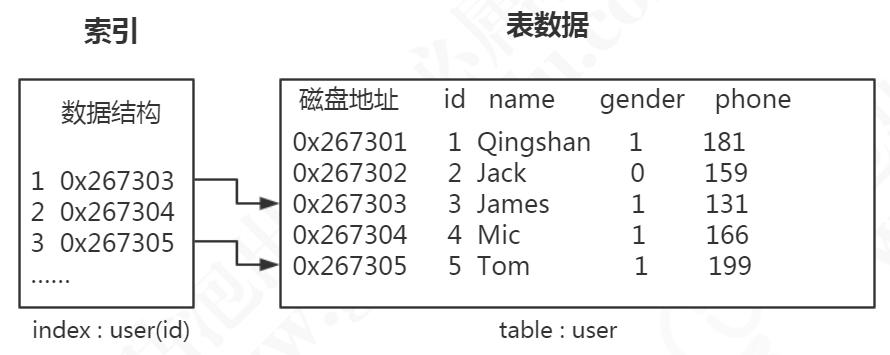

首先数据是以文件的形式存放在磁盘上面的，每一行数据都有它的磁盘地址。如果 没有索引的话，要从 500 万行数据里面检索一条数据，只能依次遍历这张表的全部数据， 直到找到这条数据。 

但是有了索引之后，只需要在索引里面去检索这条数据就行了，因为它是一种特殊 的专门用来快速检索的数据结构，我们找到数据存放的磁盘地址以后，就可以拿到数据 了。 

就像我们从一本 500 页的书里面去找特定的一小节的内容，肯定不可能从第一页开 始翻。那么这本书有专门的目录，它可能只有几页的内容，它是按页码来组织的，可以 根据拼音或者偏旁部首来查找，只要确定内容对应的页码，就能很快地找到我们想要的 内容。 

#### 1.1.2.索引类型 

怎么创建一个索引? 

  

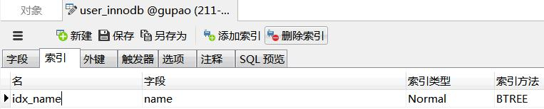

第一个是索引的名称，第二个是索引的列，比如我们是要对 id 创建索引还是对 name 创建索引。后面两个很重要，一个叫索引类型。 

在 InnoDB 里面，索引类型有三种，普通索引、唯一索引(主键索引是特殊的唯一 索引)、全文索引。 

普通(Normal):也叫非唯一索引，是最普通的索引，没有任何的限制。 

唯一(Unique):唯一索引要求键值不能重复。另外需要注意的是，主键索引是一 种特殊的唯一索引，它还多了一个限制条件，要求键值不能为空。主键索引用 primay key 创建。 

全文(Fulltext):针对比较大的数据，比如我们存放的是消息内容，有几 KB 的数 据的这种情况，如果要解决 like 查询效率低的问题，可以创建全文索引。只有文本类型 的字段才可以创建全文索引，比如 char、varchar、text。 

全文索引的使用: 
```sql
select * from fulltext_test where match(content) against('咕泡学院' IN NATURAL LANGUAGE MODE); MyISAM 和 InnoDB 支持全文索引。 
```

这个是索引的三种类型:普通、唯一、全文。 
```sql
create table m3 ( name varchar(50), fulltext index(name) ); 
```


我们说索引是一种数据结构，那么它到底应该选择一种什么数据结构，才能实现数 据的高效检索呢? 

## **2.** 索引存储模型推演 

#### 2.1. 二分查找 

双十一过去之后，你女朋友跟你玩了一个猜数字的游戏。 猜猜我昨天买了多少钱，给你五次机会。 10000?低了。30000?高了。接下来你会猜多少? 20000。为什么你不猜 11000，也不猜 29000 呢? 

其实这个就是二分查找的一种思想，也叫折半查找，每一次，我们都把候选数据缩 小了一半。如果数据已经排过序的话，这种方式效率比较高。 

所以第一个，我们可以考虑用有序数组作为索引的数据结构。 

有序数组的等值查询和比较查询效率非常高，但是更新数据的时候会出现一个问题， 可能要挪动大量的数据(改变 index)，所以只适合存储静态的数据。 

为了支持频繁的修改，比如插入数据，我们需要采用链表。链表的话，如果是单链 表，它的查找效率还是不够高。 

所以，有没有可以使用二分查找的链表呢? 

为了解决这个问题，BST(Binary Search Tree)也就是我们所说的二叉查找树诞生 了。 

#### 2.2. 二叉查找树(BST Binary Search Tree) 


  二叉查找树的特点是什么?

左子树所有的节点都小于父节点，右子树所有的节点都大于父节点。投影到平面以 后，就是一个有序的线性表。 

二叉查找树既能够实现快速查找，又能够实现快速插入。 但是二叉查找树有一个问题: 就是它的查找耗时是和这棵树的深度相关的，在最坏的情况下时间复杂度会退化成 

O(n)。 

  什么情况是最坏的情况呢?

我们打开这样一个网站来看一下，这里面有各种各样的数据结构的动态演示，包括 BST 二叉查找树: 

https://www.cs.usfca.edu/~galles/visualization/Algorithms.html 

还是刚才的这一批数字，如果我们插入的数据刚好是有序的，2、6、11、13、17、 22。 

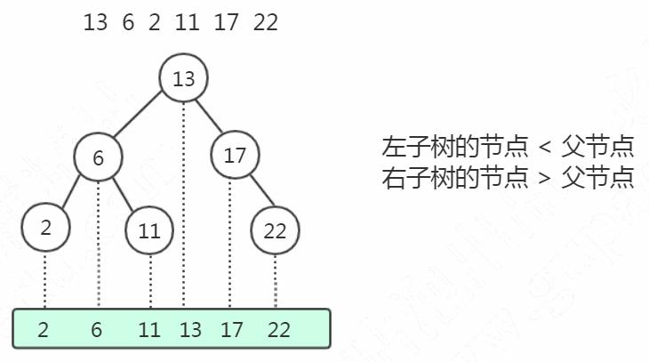 


  这个时候我们的二叉查找树变成了什么样了呢?

它会变成链表(我们把这种树叫做“斜树”)，这种情况下不能达到加快检索速度 的目的，和顺序查找效率是没有区别的。 

造成它倾斜的原因是什么呢? 因为左右子树深度差太大，这棵树的左子树根本没有节点——也就是它不够平衡。 所以，我们有没有左右子树深度相差不是那么大，更加平衡的树呢? 这个就是平衡二叉树，叫做 Balanced binary search trees，或者 AVL 树(AVL 是 

发明这个数据结构的人的名字)。 

#### 2.3. 平衡二叉树(AVL Tree)(左旋、右旋) 

AVL Trees (Balanced binary search trees) 平衡二叉树的定义:左右子树深度差绝对值不能超过 1。 是什么意思呢?比如左子树的深度是 2，右子树的深度只能是 1 或者 3。 这个时候我们再按顺序插入 1、2、3、4、5、6，一定是这样，不会变成一棵“斜树”。

 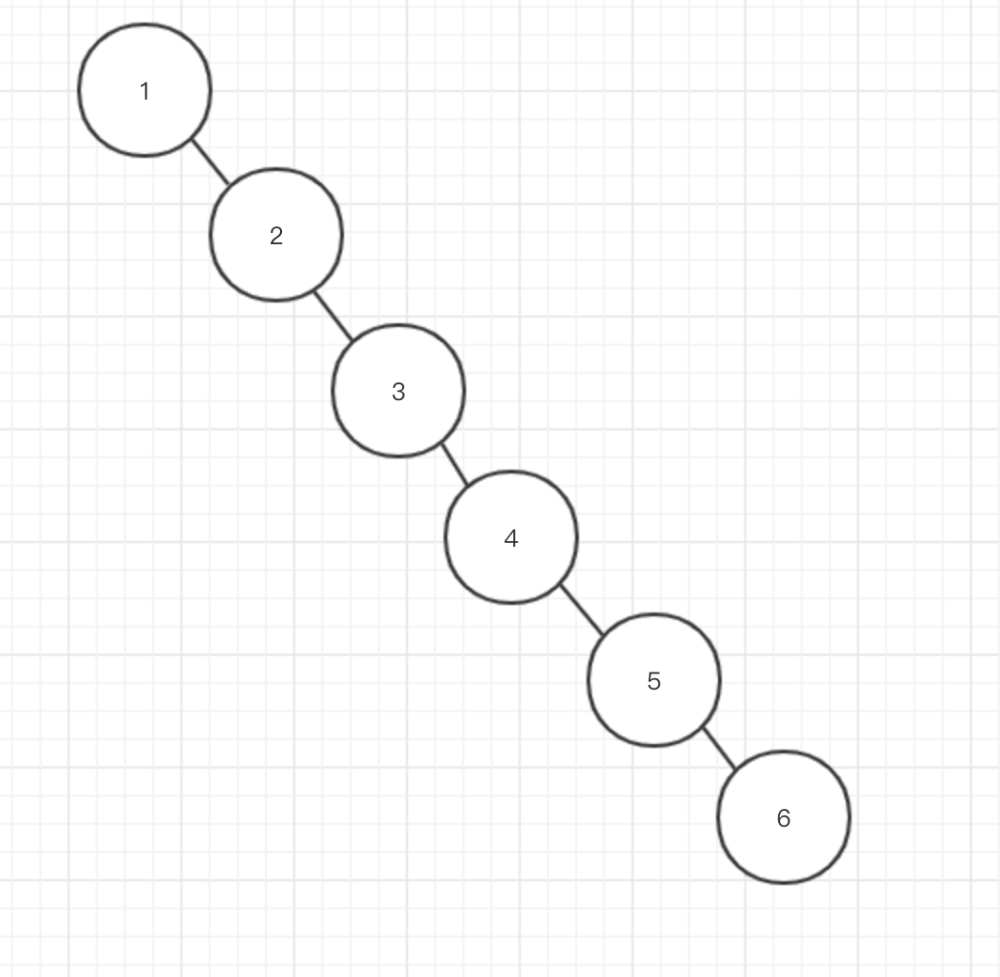


那它的平衡是怎么做到的呢?怎么保证左右子树的深度差不能超过 1 呢? 

https://www.cs.usfca.edu/~galles/visualization/AVLtree.html 

插入 1、2、3。 

我们注意看:当我们插入了 1、2 之后，如果按照二叉查找树的定义，3 肯定是要在 2 的右边的，这个时候根节点 1 的右节点深度会变成 2，但是左节点的深度是 0，因为它 没有子节点，所以就会违反平衡二叉树的定义。 

那应该怎么办呢?因为它是右节点下面接一个右节点，右-右型，所以这个时候我们 要把 2 提上去，这个操作叫做左旋。 

同样的，如果我们插入 7、6、5，这个时候会变成左左型，就会发生右旋操作，把 6 提上去。 

https://www.cs.usfca.edu/~galles/visualization/AVLtree.html 

所以为了保持平衡，AVL 树在插入和更新数据的时候执行了一系列的计算和调整的 操作。 

平衡的问题我们解决了，那么平衡二叉树作为索引怎么查询数据? 

在平衡二叉树中，一个节点，它的大小是一个固定的单位，作为索引应该存储什么 内容? 

它应该存储三块的内容: 

第一个是索引的键值。比如我们在 id 上面创建了一个索引，我在用 where id =1 的 条件查询的时候就会找到索引里面的 id 的这个键值。 

第二个是数据的磁盘地址，因为索引的作用就是去查找数据的存放的地址。 

第三个，因为是二叉树，它必须还要有左子节点和右子节点的引用，这样我们才能 找到下一个节点。比如大于 26 的时候，走右边，到下一个树的节点，继续判断。 

如果是这样存储数据的话，我们来看一下会有什么问题。 

在分析用 AVL 树存储索引数据之前，我们先来学习一下 InnoDB 的逻辑存储结构。 

#### 2.3.1.InnoDB 逻辑存储结构 

https://dev.mysql.com/doc/refman/5.7/en/innodb-disk-management.html 

https://dev.mysql.com/doc/refman/5.7/en/innodb-file-space.html 

MySQL 的存储结构分为 5 级:表空间、段、簇、页、行。 

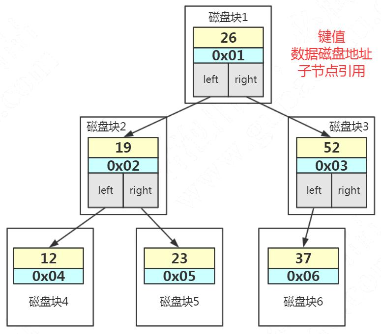  


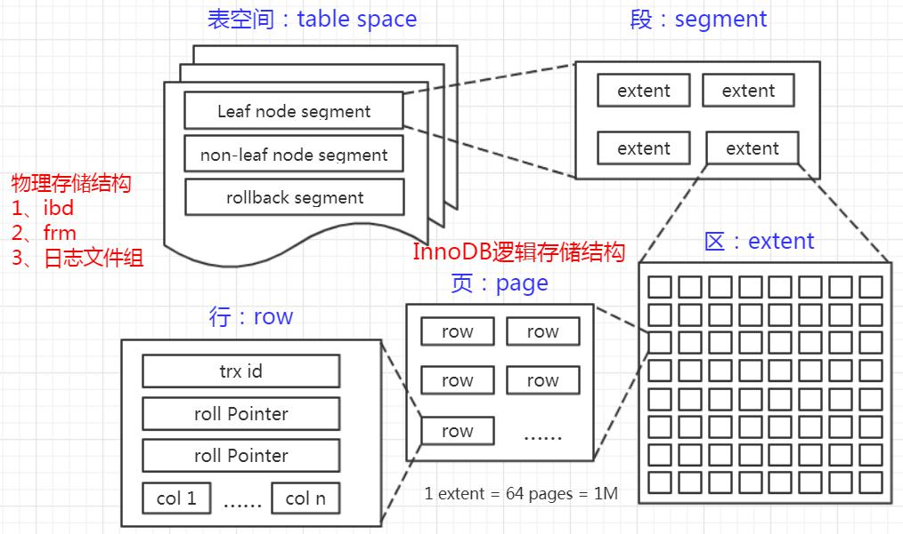

##### 表空间 Table Space 

上节课讲磁盘结构的时候讲过了，表空间可以看做是 InnoDB 存储引擎逻辑结构的 最高层，所有的数据都存放在表空间中。分为:系统表空间、独占表空间、通用表空间、 临时表空间、Undo 表空间。 

##### 段 Segment 

表空间是由各个段组成的，常见的段有数据段、索引段、回滚段等，段是一个逻辑 的概念。一个 ibd 文件(独立表空间文件)里面会由很多个段组成。 

创建一个索引会创建两个段，一个是索引段:leaf node segment，一个是数据段: non-leaf node segment。索引段管理非叶子节点的数据。数据段管理叶子节点的数据。 也就是说，一个表的段数，就是索引的个数乘以 2。 

##### 簇 Extent 

一个段(Segment)又由很多的簇(也可以叫区)组成，每个区的大小是 1MB(64 个连续的页)。 

每一个段至少会有一个簇，一个段所管理的空间大小是无限的，可以一直扩展下去， 但是扩展的最小单位就是簇。 

##### 页 Page 

为了高效管理物理空间，对簇进一步细分，就得到了页。簇是由连续的页(Page) 组成的空间，一个簇中有 64 个连续的页。 (1MB/16KB=64)。这些页面在物理上和 逻辑上都是连续的。 

跟大多数数据库一样，InnoDB 也有页的概念(也可以称为块)，每个页默认 16KB。 页是 InnoDB 存储引擎磁盘管理的最小单位，通过 innodb_page_size 设置。 

一个表空间最多拥有 2^32 个页，默认情况下一个页的大小为 16KB，也就是说一个 表空间最多存储 64TB 的数据。 

注意，文件系统中，也有页的概念。
 操作系统和内存打交道，最小的单位是页 Page。文件系统的内存页通常是 4K。 

SHOW VARIABLES LIKE 'innodb_page_size';
 假设一行数据大小是 1K，那么一个数据页可以放 16 行这样的数据。 

举例:一个页放 3 行数据。 

 

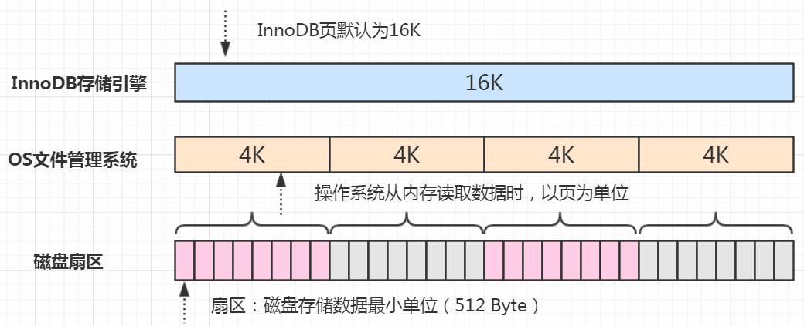 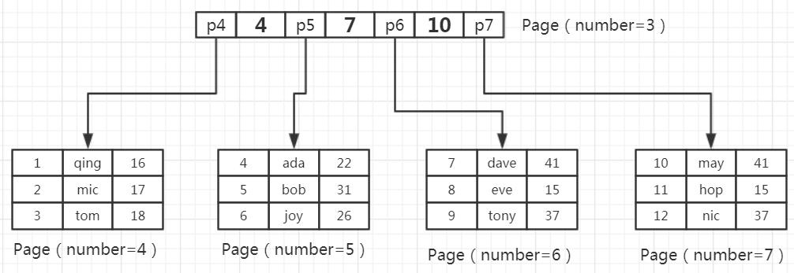

往表中插入数据时，如果一个页面已经写完，产生一个新的叶页面。如果一个簇的 所有的页面都被用完，会从当前页面所在段新分配一个簇。 

如果数据不是连续的，往已经写满的页中插入数据，会导致叶页面分裂: 

##### 行 Row 

(仅供了解) 

不连续 

InnoDB 存储引擎是面向行的(row-oriented)，也就是说数据的存放按行进行存 放。 

https://dev.mysql.com/doc/refman/5.7/en/innodb-row-format.html 

Antelope[ˈæntɪləʊp](羚羊)是 InnoDB 内置的文件格式，有两种行格式: REDUNDANT[rɪˈdʌndənt] Row Format
 COMPACT Row Format(5.6 默认) 

Barracuda[ˌbærəˈkjuːdə](梭子鱼)是 InnoDB Plugin 支持的文件格式，新增了 两种行格式: 

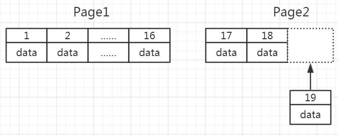

连续 

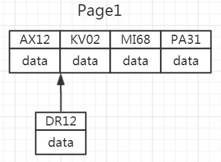 


DYNAMIC Row Format(5.7 默认) COMPRESSED Row Format 

 

| 文件格式                   | 行格式                                   | 描述                                                         |
| ------------------------- | ---------------------------------------- | ------------------------------------------------------------ |
| Antelope (Innodb-base)    | ROW_FORMAT=COMPACT ROW_FORMAT=REDUNDANT  | Compact 和 redumdant 的区别在就是在于首部的存 存内容区别。compact 的存储格式为首部为一个非 NULL 的变长字 段长度列表  redundant 的存储格式为首部是一个字段长度偏移 列表(每个字段占用的字节长度及其相应的位移)。  在 Antelope 中对于变长字段，低于 768 字节的，不 会进行 overflow page 存储，某些情况下会减少结果 集 IO. |
| Barracuda (innodb-plugin) | ROW_FORMAT=DYNAMIC ROW_FORMAT=COMPRESSED | 这两者主要是功能上的区别功能上的。 另外在行 里的变长字段和 Antelope 的区别是只存 20 个字节， 其它的 overflow page 存储。  另外这两都需要开启 innodb_file_per_table=1 |

innodb_file_format 在配置文件中指定;row_format 则在创建数据表时指定。 

在创建表的时候可以指定行格式。 
```sql
show variables like "%innodb_file_format%"; SET GLOBAL innodb_file_format=Barracuda; 
```

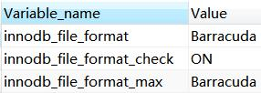

```sql
CREATE TABLE tf1 (c1 INT PRIMARY KEY) ROW_FORMAT=COMPRESSED KEY_BLOCK_SIZE=8; 
```

查看行格式: 
```sql
SHOW TABLE STATUS LIKE 'student' \G; 
```

 

 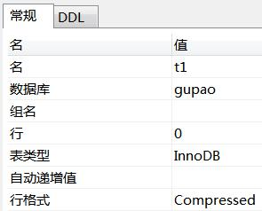

这一块的内容主要是让大家了解页 page 的概念。 下面我们继续看一下，用 AVL 树存储索引数据，会有什么样的问题。 

#### 2.3.2.AVL 树用于存储索引数据 

首先，索引的数据，是放在硬盘上的。查看数据和索引的大小: 

`select CONCAT(ROUND(SUM(DATA_LENGTH/1024/1024),2),'MB') AS data_len,` 


当我们用树的结构来存储索引的时候，访问一个节点就要跟磁盘之间发生一次 IO。 InnoDB 操作磁盘的最小的单位是一页(或者叫一个磁盘块)，大小是 16K(16384 字节)。 

那么，一个树的节点就是 16K 的大小。 

如果我们一个节点只存一个键值+数据+引用，例如整形的字段，可能只用了十几个 或者几十个字节，它远远达不到 16K 的容量，所以访问一个树节点，进行一次 IO 的时候， 浪费了大量的空间。 

所以如果每个节点存储的数据太少，从索引中找到我们需要的数据，就要访问更多 的节点，意味着跟磁盘交互次数就会过多。 

如果是机械硬盘时代，每次从磁盘读取数据需要 10ms 左右的寻址时间，交互次数 越多，消耗的时间就越多。 

比如上面这张图，我们一张表里面有 6 条数据，当我们查询 id=37 的时候，要查询 

```sql
CONCAT(ROUND(SUM(INDEX_LENGTH/1024/1024),2),'MB') as index_len from information_schema.TABLES
 where table_schema='gupao' and table_name='user_innodb'; 
```

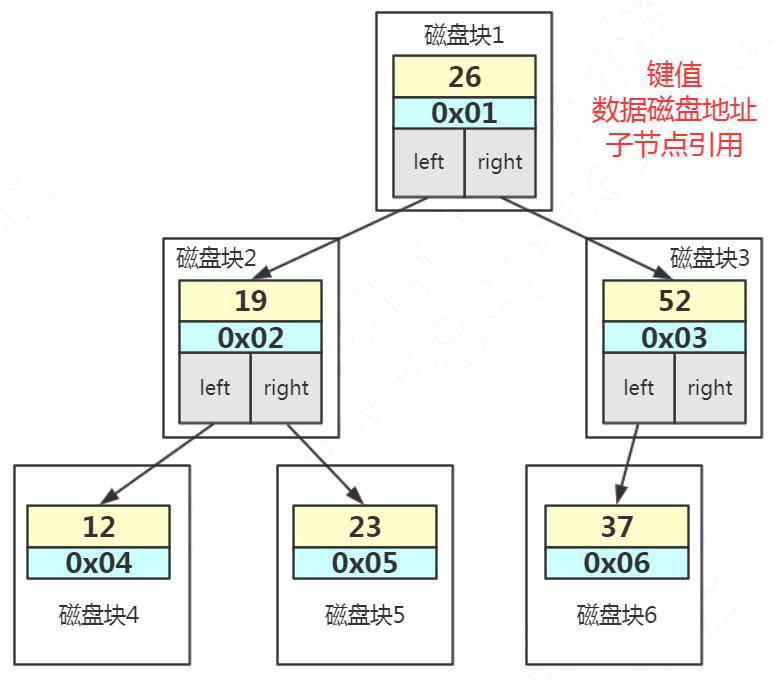


两个子节点，就需要跟磁盘交互 3 次，如果我们有几百万的数据呢?这个时间更加难以 估计。 

所以我们的解决方案是什么呢?
 第一个就是让每个节点存储更多的数据。 第二个，节点上的关键字的数量越多，我们的指针数也越多，也就是意味着可以有 

更多的分叉(我们把它叫做“路数”)。 因为分叉数越多，树的深度就会减少(根节点是 0)。 这样，我们的树是不是从原来的高瘦高瘦的样子，变成了矮胖矮胖的样子? 这个时候，我们的树就不再是二叉了，而是多叉，或者叫做多路。 

#### 2.4. 多路平衡查找树(B Tree)(分裂、合并) 

Balanced Tree
 这个就是我们的多路平衡查找树，叫做 B Tree(B 代表平衡)。
 跟 AVL 树一样，B 树在枝节点和叶子节点存储键值、数据地址、节点引用。 它有一个特点:分叉数(路数)永远比关键字数多 1。比如我们画的这棵树，每个节 

点存储两个关键字，那么就会有三个指针指向三个子节点。 

 

B Tree 的查找规则是什么样的呢? 比如我们要在这张表里面查找 15。 

因为 15 小于 17，走左边。
 因为 15 大于 12，走右边。
 在磁盘块 7 里面就找到了 15，只用了 3 次 IO。 

这个是不是比 AVL 树效率更高呢? 

那 B Tree 又是怎么实现一个节点存储多个关键字，还保持平衡的呢?跟 AVL 树有什 么区别? 

https://www.cs.usfca.edu/~galles/visualization/Algorithms.html 

比如 Max Degree(路数)是 3 的时候，我们插入数据 1、2、3，在插入 3 的时候， 本来应该在第一个磁盘块，但是如果一个节点有三个关键字的时候，意味着有 4 个指针， 子节点会变成 4 路，所以这个时候必须进行分裂。把中间的数据 2 提上去，把 1 和 3 变 成 2 的子节点。 

 

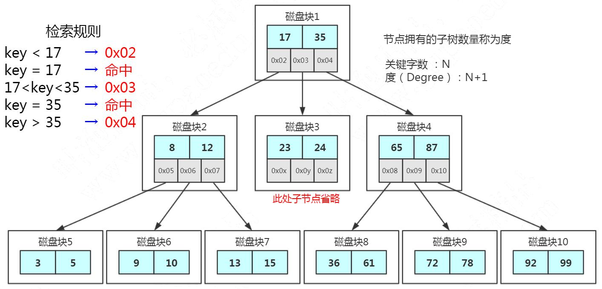


如果删除节点，会有相反的合并的操作。 注意这里是分裂和合并，跟 AVL 树的左旋和右旋是不一样的。 我们继续插入 4 和 5，B Tree 又会出现分裂和合并的操作。 

从这个里面我们也能看到，在更新索引的时候会有大量的索引的结构的调整，所以 解释了为什么我们不要在频繁更新的列上建索引，或者为什么不要更新主键。 

节点的分裂和合并，其实就是 InnoDB 页的分裂和合并。 

#### 2.5. B+树(加强版多路平衡查找树) 

B Tree 的效率已经很高了，为什么 MySQL 还要对 B Tree 进行改良，最终使用了 B+Tree 呢? 

总体上来说，这个 B 树的改良版本解决的问题比 B Tree 更全面。 我们来看一下 InnoDB 里面的 B+树的存储结构: 

 

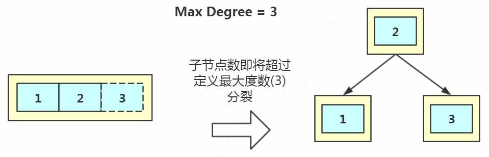

 

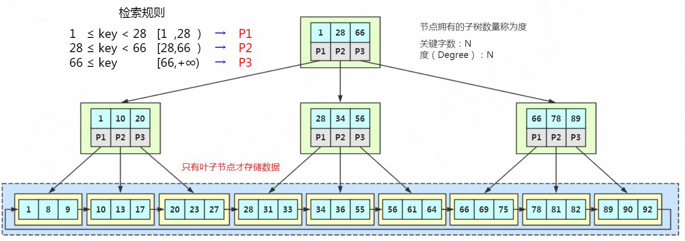

MySQL 中的 B+Tree 有几个特点:
 1、它的关键字的数量是跟路数相等的;
 2、B+Tree 的根节点和枝节点中都不会存储数据，只有叶子节点才存储数据。搜索 

到关键字不会直接返回，会到最后一层的叶子节点。比如我们搜索 id=28，虽然在第一 层直接命中了，但是全部的数据在叶子节点上面，所以我还要继续往下搜索，一直到叶 子节点。 

举个例子:假设一条记录是 1K，一个叶子节点(一页)可以存储 16 条记录。非叶 子节点可以存储多少个指针? 

假设索引字段是 bigint 类型，长度为 8 字节。指针大小在 InnoDB 源码中设置为 6 字节，这样一共 14 字节。非叶子节点(一页)可以存储 16384/14=1170 个这样的 单元(键值+指针)，代表有 1170 个指针。 

树深度为 2 的时候，有 1170^2 个叶子节点，可以存储的数据为 1170*1170*16=21902400。 

 

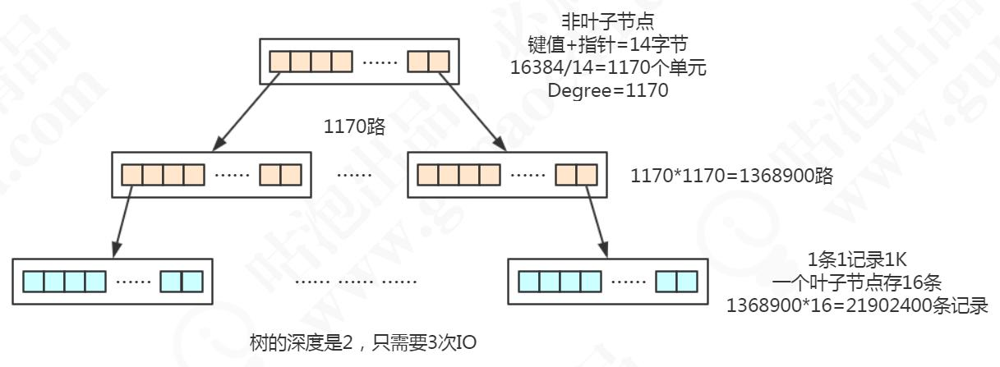

在查找数据时一次页的查找代表一次 IO，也就是说，一张 2000 万左右的表，查询 数据最多需要访问 3 次磁盘。 

所以在 InnoDB 中 B+ 树深度一般为 1-3 层，它就能满足千万级的数据存储。 

3、B+Tree 的每个叶子节点增加了一个指向相邻叶子节点的指针，它的最后一个数 据会指向下一个叶子节点的第一个数据，形成了一个有序链表的结构。 

4、它是根据左闭右开的区间 [ )来检索数据。 

我们来看一下 B+Tree 的数据搜寻过程: 

1)比如我们要查找 28，在根节点就找到了键值，但是因为它不是页子节点，所以 会继续往下搜寻，28 是[28,66)的左闭右开的区间的临界值，所以会走中间的子节点，然 后继续搜索，它又是[28,34)的左闭右开的区间的临界值，所以会走左边的子节点，最后 在叶子节点上找到了需要的数据。 

2)第二个，如果是范围查询，比如要查询从 22 到 60 的数据，当找到 22 之后，只 需要顺着节点和指针顺序遍历就可以一次性访问到所有的数据节点，这样就极大地提高 

了区间查询效率(不需要返回上层父节点重复遍历查找)。 

总结一下，InnoDB 中的 B+Tree 的特点: 

1)它是 B Tree 的变种，B Tree 能解决的问题，它都能解决。B Tree 解决的两大问题 是什么?(每个节点存储更多关键字;路数更多) 

2)扫库、扫表能力更强(如果我们要对表进行全表扫描，只需要遍历叶子节点就可以 了，不需要遍历整棵 B+Tree 拿到所有的数据) 

3) B+Tree 的磁盘读写能力相对于 B Tree 来说更强(根节点和枝节点不保存数据区， 所以一个节点可以保存更多的关键字，一次磁盘加载的关键字更多) 

4)排序能力更强(因为叶子节点上有下一个数据区的指针，数据形成了链表) 5)效率更加稳定(B+Tree 永远是在叶子节点拿到数据，所以 IO 次数是稳定的) 

#### 2.6. 为什么不用红黑树? 

红黑树也是 BST 树，但是不是严格平衡的。 必须满足 5 个约束: 

1、节点分为红色或者黑色。
 2、根节点必须是黑色的。
 3、叶子节点都是黑色的 NULL 节点。 4、红色节点的两个子节点都是黑色(不允许两个相邻的红色节点)。 5、从任意节点出发，到其每个叶子节点的路径中包含相同数量的黑色节点。 

插入:60、56、68、45、64、58、72、43、49 

 

基于以上规则，可以推导出: 

从根节点到叶子节点的最长路径(红黑相间的路径)不大于最短路径(全部是黑色 节点)的 2 倍。 

为什么不用红黑树?1、只有两路;2、不够平衡。 红黑树一般只放在内存里面用。例如 Java 的 TreeMap。 

#### 2.7. 索引方式:真的是用的 B+Tree 吗? 

在 Navicat 的工具中，创建索引，索引方式有两种，Hash 和 B Tree。 

HASH:以 KV 的形式检索数据，也就是说，它会根据索引字段生成哈希码和指针， 指针指向数据。 

 

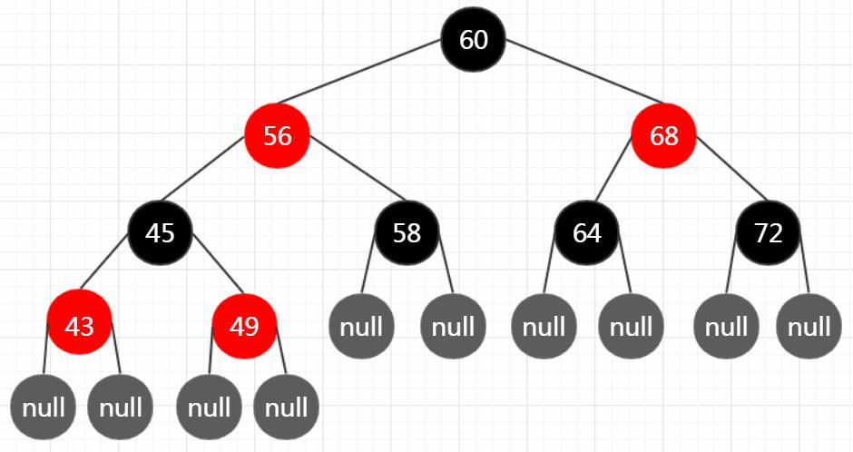 

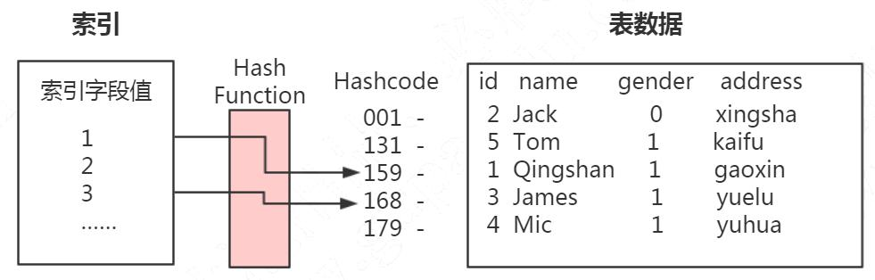

哈希索引有什么特点呢? 

第一个，它的时间复杂度是 O(1)，查询速度比较快。因为哈希索引里面的数据不是 按顺序存储的，所以不能用于排序。 

第二个，我们在查询数据的时候要根据键值计算哈希码，所以它只能支持等值查询 (= IN)，不支持范围查询(> < >= <= between and)。 

另外一个就是如果字段重复值很多的时候，会出现大量的哈希冲突(采用拉链法解 决)，效率会降低。 

问题: InnoDB 可以在客户端创建一个索引，使用哈希索引吗? 

https://dev.mysql.com/doc/refman/5.7/en/innodb-introduction.html 

InnoDB utilizes hash indexes internally for its Adaptive Hash Index feature 

直接翻译过来就是:InnoDB 内部使用哈希索引来实现自适应哈希索引特性。 

这句话的意思是 InnoDB 只支持显式创建 B+Tree 索引，对于一些热点数据页， InnoDB 会自动建立自适应 Hash 索引，也就是在 B+Tree 索引基础上建立 Hash 索引， 这个过程对于客户端是不可控制的，隐式的。 

我们在 Navicat 工具里面选择索引方法是哈希，但是它创建的还是 B+Tree 索引，这 个不是我们可以手动控制的。 

上次课我们说到 buffer pool 里面有一块区域是 Adaptive Hash Index 自适应哈希 索引，就是这个。 

这个开关默认是 ON: 
```sql
show variables like 'innodb_adaptive_hash_index'; 从存储引擎的运行信息中可以看到: 

show engine innodb status;
```


---------------------- BUFFER POOL AND MEMORY ----------------------   
------------INSERT BUFFER AND ADAPTIVE HASH INDEX ----------------

因为 B Tree 和 B+Tree 的特性，它们广泛地用在文件系统和数据库中，例如 Windows 的 HPFS 文件系统，Oracel、MySQL、SQLServer 数据库。 

## **3. B+Tree** 落地形式 

### 3.1. MySQL 架构 

MySQL 是一个支持插件式存储引擎的数据库。在 MySQL 里 面，每个表在创建的时候都可以指定它所使用的存储引擎。 

这里我们主要关注一下最常用的两个存储引擎，MyISAM 和 InnoDB 的索引的实现。 

### 3.2. MySQL 数据存储文件 

首先，MySQL 的数据都是文件的形式存放在磁盘中的，我们可以找到这个数据目录 的地址。在 MySQL 中有这么一个参数，我们来看一下: 
```sql
show VARIABLES LIKE 'datadir'; 
```

 


在这里我们能看到，每张 InnoDB 的表有两个文件(.frm 和.ibd)，MyISAM 的表 有三个文件(.frm、.MYD、.MYI)。 

有一个是相同的文件，.frm。 .frm 是 MySQL 里面表结构定义的文件，不管你建表 的时候选用任何一个存储引擎都会生成。 

我们主要看一下其他两个文件是怎么实现 MySQL 不同的存储引擎的索引的。 

#### 3.2.1.MyISAM 

在 MyISAM 里面，另外有两个文件: 

一个是.MYD 文件，D 代表 Data，是 MyISAM 的数据文件，存放数据记录，比如我 们的 user_myisam 表的所有的表数据。 

一个是.MYI 文件，I 代表 Index，是 MyISAM 的索引文件，存放索引，比如我们在 id 字段上面创建了一个主键索引，那么主键索引就是在这个索引文件里面。 

也就是说，在 MyISAM 里面，索引和数据是两个独立的文件。 那我们怎么根据索引找到数据呢?
 MyISAM 的 B+Tree 里面，叶子节点存储的是数据文件对应的磁盘地址。所以从索 

引文件.MYI 中找到键值后，会到数据文件.MYD 中获取相应的数据记录。 

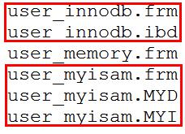


这里是主键索引，如果是辅助索引，有什么不一样呢?
 在 MyISAM 里面，辅助索引也在这个.MYI 文件里面。 辅助索引跟主键索引存储和检索数据的方式是没有任何区别的，一样是在索引文件 

里面找到磁盘地址，然后到数据文件里面获取数据。 

 

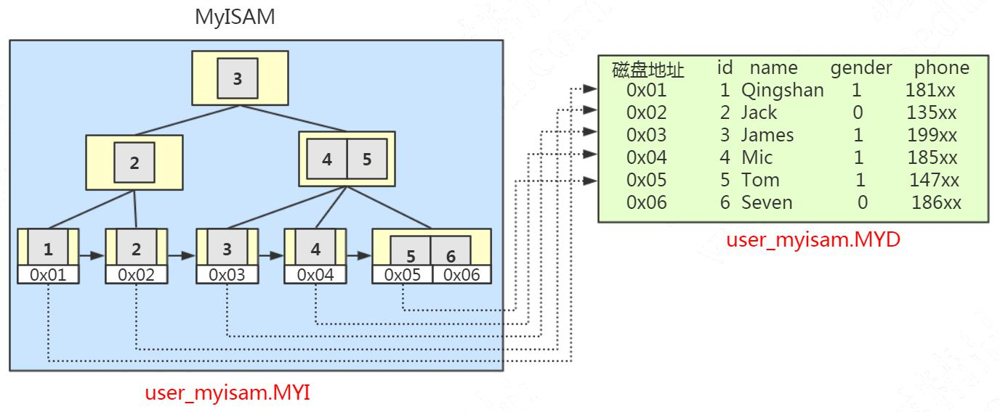 

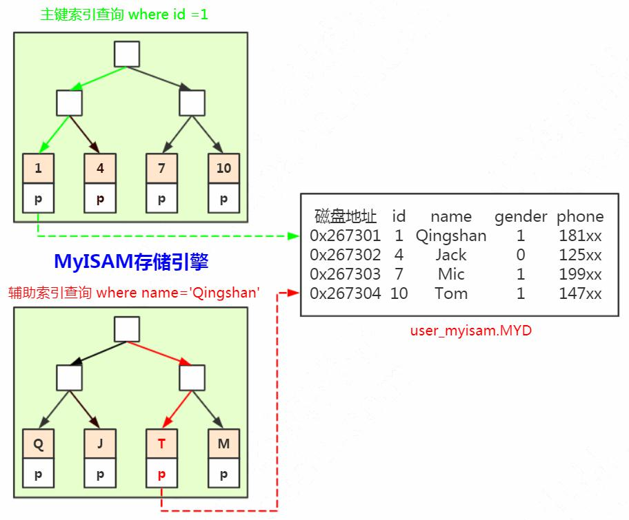

 

## 3.2.2.InnoDB 

InnoDB 只有一个文件(.ibd 文件)，那索引放在哪里呢? 

在 InnoDB 里面，它是以主键为索引来组织数据的存储的，所以索引文件和数据文 件是同一个文件，都在.ibd 文件里面。 

在 InnoDB 的主键索引的叶子节点上，它直接存储了我们的数据。 

 

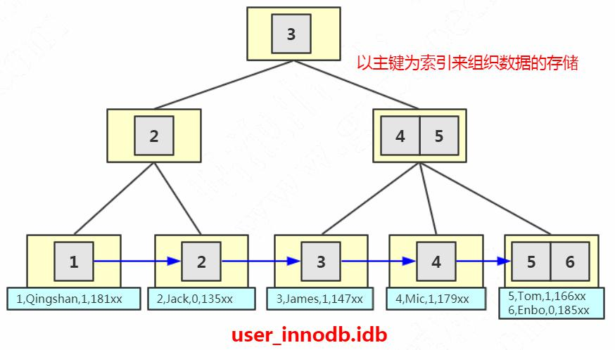

####  什么叫做聚集索引(聚簇索引)?

就是索引键值的逻辑顺序跟表数据行的物理存储顺序是一致的。(比如字典的目录 是按拼音排序的，内容也是按拼音排序的，按拼音排序的这种目录就叫聚集索引)。 

在 InnoDB 里面，它组织数据的方式叫做叫做(聚集)索引组织表(clustered index organize table)，所以主键索引是聚集索引，非主键都是非聚集索引。 

如果 InnoDB 里面主键是这样存储的，那主键之外的索引，比如我们在 name 字段 上面建的普通索引，又是怎么存储和检索数据的呢? 

 

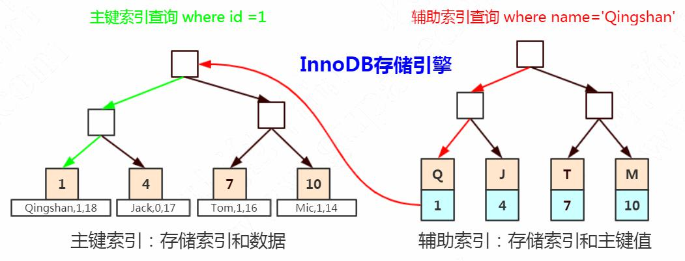

InnoDB 中，主键索引和辅助索引是有一个主次之分的。 

辅助索引存储的是辅助索引和主键值。如果使用辅助索引查询，会根据主键值在主 键索引中查询，最终取得数据。 

比如我们用 name 索引查询 name= '青山'，它会在叶子节点找到主键值，也就是 id=1，然后再到主键索引的叶子节点拿到数据。 

为什么在辅助索引里面存储的是主键值而不是主键的磁盘地址呢?如果主键的数据 类型比较大，是不是比存地址更消耗空间呢? 

我们前面说到 B Tree 是怎么实现一个节点存储多个关键字，还保持平衡的呢? 

是因为有分叉和合并的操作，这个时候键值的地址会发生变化，所以在辅助索引里 面不能存储地址。 

另一个问题，如果一张表没有主键怎么办?
 1、如果我们定义了主键(PRIMARY KEY)，那么 InnoDB 会选择主键作为聚集索引。 2、如果没有显式定义主键，则 InnoDB 会选择第一个不包含有 NULL 值的唯一索引 

作为主键索引。
 3、如果也没有这样的唯一索引，则 InnoDB 会选择内置 6 字节长的 ROWID 作为隐 

藏的聚集索引，它会随着行记录的写入而主键递增。 
```sql
select _rowid name from t2;
```

##  **4.** 索引使用原则 

我们容易有以一个误区，就是在经常使用的查询条件上都建立索引，索引越多越好， 那到底是不是这样呢? 

 

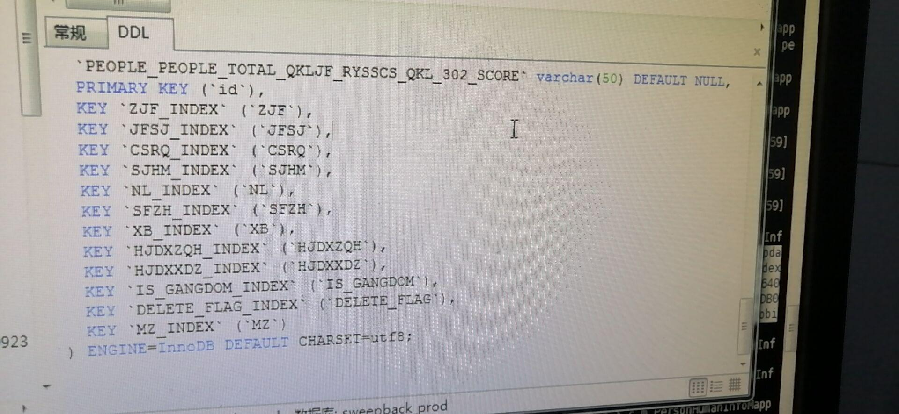

### 4.1. 列的离散(sàn)度 

第一个叫做列的离散度，我们先来看一下列的离散度的公式: 

count(distinct(column_name)) : count(*)，列的全部不同值和所有数据行的比例。 数据行数相同的情况下，分子越大，列的离散度就越高。 

简单来说，如果列的重复值越多，离散度就越低，重复值越少，离散度就越高。 

了解了离散度的概念之后，我们再来思考一个问题，我们在 name 上面建立索引和 在 gender 上面建立索引有什么区别。 

当我们用在 gender 上建立的索引去检索数据的时候，由于重复值太多，需要扫描的 行数就更多。例如，我们现在在 gender 列上面创建一个索引，然后看一下执行计划。 

 

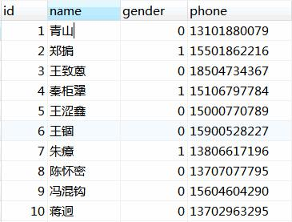
```sql
ALTER TABLE user_innodb DROP INDEX idx_user_gender;
ALTER TABLE user_innodb ADD INDEX idx_user_gender (gender); -- 耗时比较久 EXPLAIN SELECT * FROM `user_innodb` WHERE gender = 0; 

```

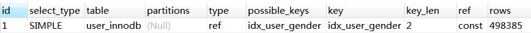

```sql
show indexes from user_innodb;

```
而 name 的离散度更高，比如“青山”的这名字，只需要扫描一行。 

查看表上的索引，Cardinality [kɑ:dɪ'nælɪtɪ] 代表基数，代表预估的不重复的值 31 

```sql
ALTER TABLE user_innodb DROP INDEX idx_user_name; ALTER TABLE user_innodb ADD INDEX idx_user_name (name); EXPLAIN SELECT * FROM `user_innodb` WHERE name = '青山'; 

```

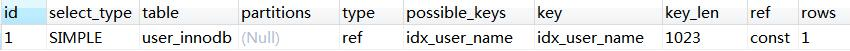 

的数量。索引的基数与表总行数越接近，列的离散度就越高。 

```sql
show indexes from user_innodb;
```
 如果在 B+Tree 里面的重复值太多，MySQL 的优化器发现走索引跟使用全表扫描差 

不了多少的时候，就算建了索引，也不一定会走索引。 

https://www.cs.usfca.edu/~galles/visualization/BPlusTree.html 

这个给我们的启发是什么?建立索引，要使用离散度(选择度)更高的字段。 

### 4.2. 联合索引最左匹配 

前面我们说的都是针对单列创建的索引，但有的时候我们的多条件查询的时候，也 会建立联合索引。单列索引可以看成是特殊的联合索引。 

比如我们在 user 表上面，给 name 和 phone 建立了一个联合索引。 

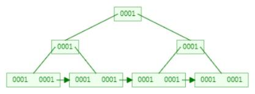

```sql
ALTER TABLE user_innodb DROP INDEX comidx_name_phone;
ALTER TABLE user_innodb add INDEX comidx_name_phone (name,phone); 
```


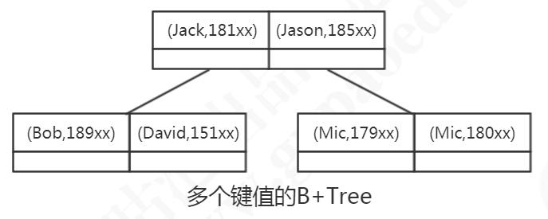

联合索引在 B+Tree 中是复合的数据结构，它是按照从左到右的顺序来建立搜索树的 (name 在左边，phone 在右边)。 

从这张图可以看出来，name 是有序的，phone 是无序的。当 name 相等的时候， phone 才是有序的。 

这个时候我们使用 where name= '青山' and phone = '136xx '去查询数据的时候， B+Tree 会优先比较 name 来确定下一步应该搜索的方向，往左还是往右。如果 name 相同的时候再比较 phone。但是如果查询条件没有 name，就不知道第一步应该查哪个 节点，因为建立搜索树的时候 name 是第一个比较因子，所以用不到索引。 5.2.1.什么时候用到联合索引 

所以，我们在建立联合索引的时候，一定要把最常用的列放在最左边。 比如下面的三条语句，能用到联合索引吗? 

1)使用两个字段，可以用到联合索引:
 EXPLAIN SELECT * FROM user_innodb WHERE name= '权亮' AND phone = '15204661800'; 

2)使用左边的 name 字段，可以用到联合索引: 33 

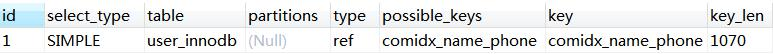 


```sql
EXPLAIN SELECT * FROM user_innodb WHERE name= '权亮' 
```

3)使用右边的 phone 字段，无法使用索引，全表扫描: EXPLAIN SELECT * FROM user_innodb WHERE phone = '15204661800' 

#### 4.2.1.如何创建联合索引 

有一天我们的 DBA 找到我，说我们的项目里面有两个查询很慢。 

按照我们的想法，一个查询创建一个索引，所以我们针对这两条 SQL 创建了两个索 引，这种做法觉得正确吗? 

当我们创建一个联合索引的时候，按照最左匹配原则，用左边的字段 name 去查询 的时候，也能用到索引，所以第一个索引完全没必要。 

相当于建立了两个联合索引(name),(name,phone)。 如果我们创建三个字段的索引 index(a,b,c)，相当于创建三个索引: index(a) 

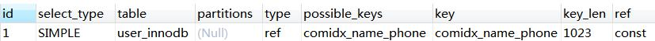
 
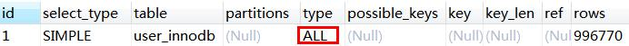

```sql
SELECT * FROM user_innodb WHERE name= ? AND phone = ?; SELECT * FROM user_innodb WHERE name= ?; 

CREATE INDEX idx_name on user_innodb(name);
CREATE INDEX idx_name_phone on user_innodb(name,phone);  
```

index(a,b)
 index(a,b,c)
 用 where b=? 和 where b=? and c=? 和 where a=? and c=?是不能使用到索引 

的。不能不用第一个字段，不能中断。 

这里就是 MySQL 联合索引的最左匹配原则。 

### 4.3. 覆盖索引 

回表: 

非主键索引，我们先通过索引找到主键索引的键值，再通过主键值查出索引里面没 有的数据，它比基于主键索引的查询多扫描了一棵索引树，这个过程就叫回表。 

例如: ```sql  select * from user_innodb where name = 'Tom';  ```


在辅助索引里面，不管是单列索引还是联合索引，如果 select 的数据列只用从索引 中就能够取得，不必从数据区中读取，这时候使用的索引就叫做覆盖索引，这样就避免 了回表。 

我们先来创建一个联合索引: 

  这三个查询语句都用到了覆盖索引:

Extra 里面值为“Using index”代表使用了覆盖索引。 

select * ，用不到覆盖索引。 

如果改成只用 where phone = 查询呢?动手试试? 

很明显，因为覆盖索引减少了 IO 次数，减少了数据的访问量，可以大大地提升查询 效率。 

### 4.4. 索引条件下推(ICP) 

https://dev.mysql.com/doc/refman/5.7/en/index-condition-pushdown-optimization.html 

再来看这么一张表，在 last_name 和 first_name 上面创建联合索引。 


```sql
# 创建联合索引 ALTER TABLE user_innodb DROP INDEX comixd_name_phone;
ALTER TABLE user_innodb add INDEX `comixd_name_phone` (`name`,`phone`); 

EXPLAIN SELECT name,phone FROM user_innodb WHERE name= '青山' AND phone = ' 13666666666'; EXPLAIN SELECT name FROM user_innodb WHERE name= '青山' AND phone = ' 13666666666'; EXPLAIN SELECT phone FROM user_innodb WHERE name= '青山' AND phone = ' 13666666666'; 

```

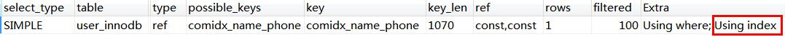
 
```sql
drop table employees;
CREATE TABLE `employees` ( 
 `emp_no` int(11) NOT NULL,
 `birth_date` date NULL,
 `first_name` varchar(14) NOT NULL, 
 `last_name` varchar(16) NOT NULL,
 `gender` enum('M','F') NOT NULL,
 `hire_date` date NULL,
 PRIMARY KEY (`emp_no`) 
) ENGINE=InnoDB DEFAULT CHARSET=latin1; 


alter table employees add index idx_lastname_firstname(last_name,first_name); 

INSERT INTO `employees` (`emp_no`, `birth_date`, `first_name`, `last_name`, NULL, '698', 'liu', 'F', NULL);
INSERT INTO `employees` (`emp_no`, `birth_date`, `first_name`, `last_name`, NULL, 'd99', 'zheng', 'F', NULL); 

INSERT INTO `employees` (`emp_no`, `birth_date`, `first_name`, `last_name`, NULL, 'e08', 'huang', 'F', NULL);
INSERT INTO `employees` (`emp_no`, `birth_date`, `first_name`, `last_name`, NULL, '59d', 'lu', 'F', NULL); 

INSERT INTO `employees` (`emp_no`, `birth_date`, `first_name`, `last_name`, NULL, '0dc', 'yu', 'F', NULL);
INSERT INTO `employees` (`emp_no`, `birth_date`, `first_name`, `last_name`, NULL, '989', 'wang', 'F', NULL); 

INSERT INTO `employees` (`emp_no`, `birth_date`, `first_name`, `last_name`, NULL, 'e38', 'wang', 'F', NULL);
INSERT INTO `employees` (`emp_no`, `birth_date`, `first_name`, `last_name`, NULL, '0zi', 'wang', 'F', NULL); 

INSERT INTO `employees` (`emp_no`, `birth_date`, `first_name`, `last_name`, NULL, 'dc9', 'xie', 'F', NULL);
INSERT INTO `employees` (`emp_no`, `birth_date`, `first_name`, `last_name`, NULL, '5ba', 'zhou', 'F', NULL); 
```

关闭 ICP:set optimizer_switch='index_condition_pushdown=off'; 

查看参数: 

```sql show variables like 'optimizer_switch'; ```

现在我们要查询所有姓 wang，并且名字最后一个字是 zi 的员工，比如王胖子，王 瘦子。查询的 SQL: 

```sql select * from employees where last_name='wang' and first_name LIKE '%zi' ;  ```

这条 SQL 有两种执行方式: 

1、根据联合索引查出所有姓 wang 的二级索引数据，然后回表，到主键索引上查询 全部符合条件的数据(3 条数据)。然后返回给 Server 层，在 Server 层过滤出名字以 zi 结尾的员工。 

2、根据联合索引查出所有姓 wang 的二级索引数据(3 个索引)，然后从二级索引 中筛选出 first_name 以 zi 结尾的索引(1 个索引)，然后再回表，到主键索引上查询全 部符合条件的数据(1 条数据)，返回给 Server 层。 

很明显，第二种方式到主键索引上查询的数据更少。 

注意，索引的比较是在存储引擎进行的，数据记录的比较，是在 Server 层进行的。 而当 first_name 的条件不能用于索引过滤时，Server 层不会把 first_name 的条件传递 给存储引擎，所以读取了两条没有必要的记录。 

这时候，如果满足 last_name='wang'的记录有 100000 条，就会有 99999 条没有 必要读取的记录。 

执行以下 SQL，Using where: 


```sql
explain select * from employees where last_name='wang' and first_name LIKE '%zi' ; 
```

Using Where 代表从存储引擎取回的数据不全部满足条件，需要在 Server 层过滤。 

先用 last_name 条件进行索引范围扫描，读取数据表记录，然后进行比较，检查是 否符合 first_name LIKE '%zi' 的条件。此时 3 条中只有 1 条符合条件。 

开启 ICP: 
```sql
set optimizer_switch='index_condition_pushdown=on'; 此时的执行计划，Using index condition: 
```

把 first_name LIKE '%zi'下推给存储引擎后，只会从数据表读取所需的 1 条记录。 索引条件下推(Index Condition Pushdown)，5.6 以后完善的功能。只适用于二 

级索引。ICP 的目标是减少访问表的完整行的读数量从而减少 I/O 操作。 **5.** 索引的创建与使用 

因为索引对于改善查询性能的作用是巨大的，所以我们的目标是尽量使用索引。 

### 4.5 索引的创建 

 1、在用于 where 判断 order 排序和 join 的(on)字段上创建索引

 2、索引的个数不要过多。 

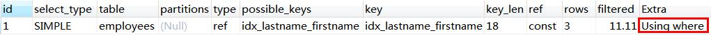 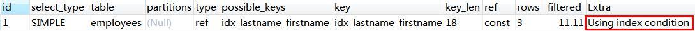

——浪费空间，更新变慢。

 3、区分度低的字段，例如性别，不要建索引。 ——离散度太低，导致扫描行数过多。

 4、频繁更新的值，不要作为主键或者索引。 ——页分裂
 5、组合索引把散列性高(区分度高)的值放在前面。 

6、创建复合索引，而不是修改单列索引。

 7、过长的字段，怎么建立索引?

 8、为什么不建议用无序的值(例如身份证、UUID )作为索引? 

### 4.6 什么时候用不到索引? 

1、索引列上使用函数(replace\SUBSTR\CONCAT\sum count avg)、表达式、 计算(+ - * /): 
```sql
explain SELECT * FROM `t2` where id+1 = 4; 2、字符串不加引号，出现隐式转换 

 ALTER TABLE user_innodb DROP INDEX comidx_name_phone;
 ALTER TABLE user_innodb add INDEX comidx_name_phone (name,phone); 

explain SELECT * FROM `user_innodb` where name = 136; explain SELECT * FROM `user_innodb` where name = '136'; 

```

3、like 条件中前面带% 

where 条件中 like abc%，like %2673%，like %888 都用不到索引吗?为什么? 

过滤的开销太大，所以无法使用索引。这个时候可以用全文索引。 4、负向查询
 NOT LIKE 不能: 
```sql
explain select *from employees where last_name not like 'wang' != (<>)和 NOT IN 在某些情况下可以: 
```

注意一个 SQL 语句是否使用索引，跟数据库版本、数据量、数据选择度都有关系。 

其实，用不用索引，最终都是优化器说了算。
 优化器是基于什么的优化器?
 基于 cost 开销(Cost Base Optimizer)，它不是基于规则(Rule-Based Optimizer)， 

也不是基于语义。怎么样开销小就怎么来。 

https://docs.oracle.com/cd/B10501_01/server.920/a96533/rbo.htm#38960 https://dev.mysql.com/doc/refman/5.7/en/cost-model.html 
```sql
explain select *from user_innodb where name like 'wang%'; explain select *from user_innodb where name like '%wang'; 

explain select *from employees where emp_no not in (1) explain select *from employees where emp_no <> 1 

```
`