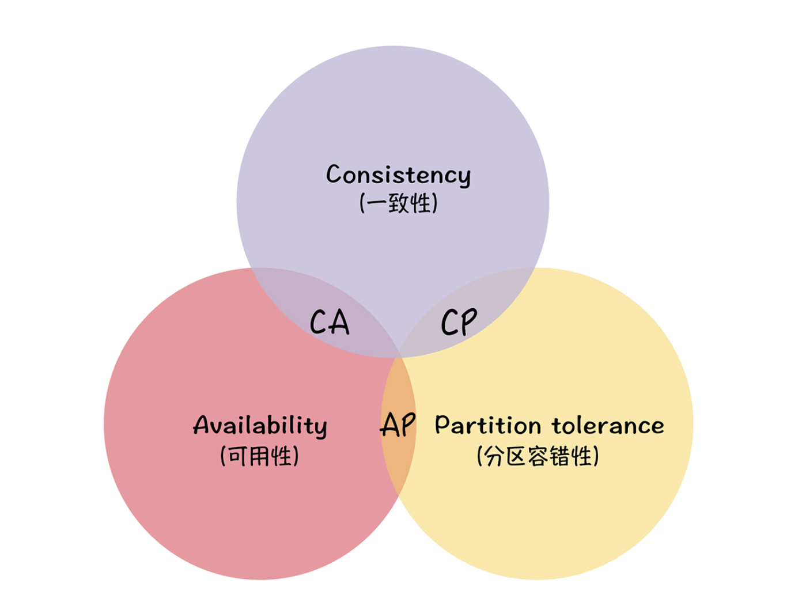

# 分布式算法和协议-理论  

## 分布式计算的八大谬论

1. ### 网络是可靠的  

2. ### 网络延迟是0  

3. ### 带宽是无限的  

4. ### 网络是安全的

5. ### 网络拓扑是从不改变的  

6. ### 只有一个管理员  

7. ### 传输成本是0  

8. ### 网络是同构的  

## CAP 理论

### Consistency

一致性：指客户端每次操作，不管访问那个节点，要么读到的都是同一份最新数据，要么失败。 **一致性强调的是各个节点间的数据一致性，而不是强调的数据完整性**   

**二阶段提交协议**，不仅仅是协议，也是一种非常经典的思想。二阶段提交在达成提交操作共识的算法中应用广泛，比如 XA 协议、TCC、Paxos、Raft 等。我希望你不仅能理解二阶段提交协议，更能理解协议背后的二阶段提交的思想，当后续需要时，能灵活地根据二阶段提交思想，设计新的事务或一致性协议。

**幂等性**，是指同一操作对同一系统的任意多次执行，所产生的影响均与一次执行的影响相同，不会因为多次执行而产生副作用。常见的实现方法有 Token、索引等。它的本质是通过唯一标识，标记同一操作的方式，来消除多次执行的副作用。

Paxos、Raft 等强一致性算法，也采用了二阶段提交操作，在“提交请求阶段”，只要大多数节点确认就可以，而具有 ACID 特性的事务，则要求全部节点确认可以。所以可以将具有 ACID 特性的操作，理解为最强的一致性。

**建议在开发实现分布式系统，如果不是必须，尽量不要实现事务，可以考虑采用强一致性或最终一致性**

###  Availability

可用性：指说任何来自客户端的请求，不管访问那个节点，都能得到响应，但是不保证是同一份最新数据，**可用性强调的是服务可用，但是不保证数据一致**

### Partition Tolerance

分区容错性：指当前节点出现任意数量的消息丢失或者高延迟的时候，系统仍然可以继续提供服务，**分区容错性是不管我的内部出现什么样的数据同步问题，我一直运行，提供服务，强调的是集群对分区故障的容错能力** ，该特性是在分布式中必须要考虑的一个  

## BASE 理论

### Basically Availabel

基本可用 ：指分布式系统出现故障的时候，允许损失部分可用性，即保证可信可用。

它主要强调的是：基本可用在本质上是一种妥协，也就是在出现节点故障或者系统过载的时候，通过牺牲非核心功能的可用性，保障核心功能的稳定运行。 基本可用的四板斧 **流量削峰、延迟响应、体验降级、过载保护**

### Soft State

软状态 ：允许系统存在**中间状态**，而该中间状态不会影响系统整体可用性。分布式存储中一般数据至少会有三个副本，允许不同节点间副本的延时就是软状态的体现。 MySQL replication的异步复制就是一种体现

### Eventual Consistency

最终一致性： 指系统中的所有数据副本经过一定时间后，最终能够叨叨一致的状态。弱一致性和强一致性相反，最终一致性是弱一致性的一种特殊情况。

 实现最终一致性的几种方式：

  * 读时修复

  * 写时修复

    写时修复不需要做数据一致性对比，性能消耗比较低，对系统运行影响也不大。比较优秀，应优先应用。也可以实现一些**自定义写一致性级别**：ALL、Quorum、One、Any

		* 异步修复

### 总结

1. BASE 理论是对 CAP 中一致性和可用性权衡的结果，它来源于对大规模互联网分布式系统实践的总结，是基于 CAP 定理逐步演化而来的。它的核心思想是，如果不是必须的话，不推荐实现事务或强一致性，鼓励可用性和性能优先，根据业务的场景特点，来实现非常弹性的基本可用，以及实现数据的最终一致性。

2. BASE 理论主张通过牺牲部分功能的可用性，实现整体的基本可用，也就是说，通过服务降级的方式，努力保障极端情况下的系统可用性。

3. ACID 理论是传统数据库常用的设计理念，追求强一致性模型。BASE 理论支持的是大型分布式系统，通过牺牲强一致性获得高可用性。BASE 理论在很大程度上，解决了事务型系统在性能、容错、可用性等方面痛点。另外我再多说一句，BASE 理论在 NoSQL 中应用广泛，是 NoSQL 系统设计的事实上的理论支撑。

​	